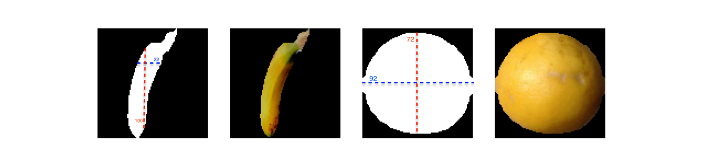

# Fruit-Image-Classification-Using-Image-Processing-Algorithms

As the project of the Image Processing course of my university, we were asked to classify very resembling fruit images, without using Neural Networks. Specifically, we were asked to classify 15 classes of the [Kaggle's Fruit 360](https://www.kaggle.com/moltean/fruits/data) dataset. In order to do so, I designed a feature extractor and fed those features to an Extra-Trees Classifier. here, I will briefly explain the feature extractor:
		
First and foremost, I created a mask that separates the fruit from its background. This mask is created using a threshold on the values of the pixels. Since this mask usually contains little bits of the background, using Morphological Erosion, I make sure that the mask is limited to the image:

---

Then the features are:

1. The dominating (Argmax) value of the hue channel of the fruit area of the image, in order to know the dominant color in the fruit.

2. max-height, 3 max-width in the mask, and 4. logarithm of max-height over max-width to separate classes like bananas from oranges. This is due to the fact that round images (e.g., an orange) would have an almost 1:1 width-height ratio whereas for tall images (e.g., a banana) the proportion would be very different.

---

5. The size of the Morphological skeleton of the image, to understand how round the image is (e.g., an ellipse has a longer skeleton than a circle). 

---

6. Sum of derivatives of the image in RGB mode, and 7. sum of derivatives of image’s Value in HSV (the third channel), to understand how smooth or rough the fruit’s texture is. 

8. mean of width and 9. mean of height values of the mask, for further clues regarding the shape. 

10. Finally, the dominant (Argmax) of image’s Saturation values (after HSV) seemed to be very useful. 

Using these features, the Extra-Trees Classifier achieved 95.06% accuracy!

In the following table, you can see how different features helped the classifier, as well as the best combination!

---
